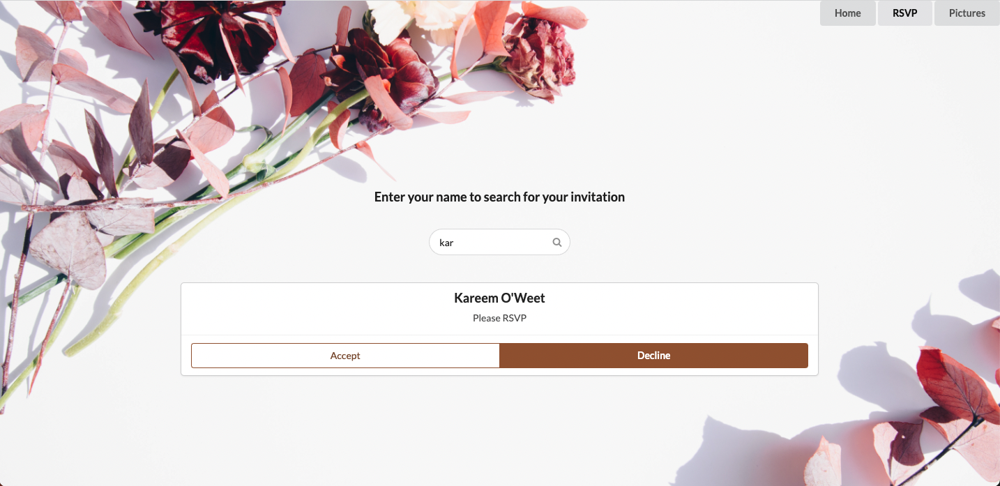

# Event Website 

This application shows the guest view of an event website. It has 
    * a home page with event details, 
    * an RSVP page with a form that allows guests to accept or decline invitation,
    * and a Pictures page that has pictures from the event and also allows guests to share their pictures of the party with the host.

All of the above is persisted on the backend.

## Front End 

The front-end of the website is built using React.

https://github.com/8eth/event-website-front-end

## Back End (Data Storage)
The back-end of the website is built using Ruby, Sinatra, and ActiveRecord.

https://github.com/8eth/event-website-back-end

## User Stories

The application allows the user to 

    * view party detail
    * search for their name from the guest list,
    * accept or decline invitation,
    * add pictures from the party on the pictures page

## Styling

This application uses semantic UI and some css code for styling.

## Author

Beth Fekadu: https://github.com/8eth